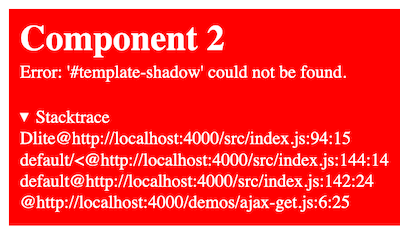

# Configuration

A configuration with examples for all possible settings.

```js
{
  el: '#app',
  tagName: 'hello-world',
  template: `Hello {this.world} {this.prop.name}!`,
  shadowDOM: true,
  $store: Litestate(),
  data: {
    world: 'World',
    helloWorld(state) {
      // computed data
      return `Hello {this.data.world}!`;
    }
  },
  created() {
    console.log(`Component created with ${this.prop}`);
  },
  updated() {
    console.log(`Component updated with ${this.data}`);
  },
  removed() {
    console.log(`Component removed: ${this.el}`);
  },
  sayHello(name) {
    // custom method
    console.log(`Hello ${name}`);
  },
}
```

## Settings

### `el`
[`string` | `HTMLElement`]

The element where the component will be created and rendered.

This can be an HTML selector (e.g. `#someId`, `[some-data-attribute]`) or a DOM element (e.g. `document.querySelector('#myId')`).

```html
<script type="module">
  import Dlite from '//unpkg.com/dlite';

  Dlite({
    el: '#app',  // document.querySelector('#app')
    template: `Hello {this.world}!`,
    data: {
      world: 'World',
    }
  });
</script>

<template id="app">
</template>
```

If `template` is not set, the `innerHTML` of the element will be used as the template as an [in-place element](components/index.md#in-place-element).

```html
<script type="module">
  import Dlite from '//unpkg.com/dlite';

  Dlite({
    el: '#app',
    data: {
      world: 'World',
    }
  });
</script>

<template id="app">
  Hello {this.world}!
</template>
```

### `tagName`
[`string`]

Name for the [custom element](components/index.md#custom-element) where the component will be created and rendered. Required for [custom elements](components/index.md#custom-element).

```{warning}
Custom element names **must** contain a hyphen. `my-counter` will be used as `<my-counter></my-counter>`
```

```html
<script type="module">
  import Dlite from '//unpkg.com/dlite';

  Dlite({
    tagName: 'hello-world',
    template: `Hello {this.world}!`,
    data: {
      world: 'World',
    }
  });
</script>

<hello-world></hello-world>
```

### `template`
[`string`]

Markup for the HTML of the component.

Required for [custom elements](components/index.md#custom-element). If `template` and `el` are set, the `template` will override the `innerHTML` of the `el`.

```html
<script type="module">
  import Dlite from '//unpkg.com/dlite';

  Dlite({
    tagName: 'hello-world',
    template: `Hello {this.world}!`,
    data: {
      world: 'World',
    }
  });
</script>

<hello-world></hello-world>
```

### `data`
[`object`]

Reactive application state. Whenever a property is updated or removed it will trigger a DOM update (if necessary).

```{warning}
Keys must be present at initialization to be reactive. Adding a new a key after initialization will _not_ trigger an update.
```

Values are expected to be a `string`, `number`, `object`, `array`, `boolean`, `null`, `undefined` or `function`.

#### Computed data

Computed data is defined as a `function` in the `data` object. It is reactive and created based on some other input. Whenever the component state is updated, the computed data will also be updated.

Computed data functions accept the current state as the only argument and must return a value. The value will be assigned in the `data` with the function's name.

```js
data: {
  firstName: 'Mardix',
  lastName: 'M.',

  // used in a template with `{this.fullName}` or 'this.data.fullName' in JavaScript
  fullName: (state) => `${state.firstName} ${state.lastName}`,

  // used in a template with '{this.totalChars}' or 'this.data.totalChars' in JavaScript
  totalChars: (state) => state.fullName.length
}
```

```{note}
You cannot access the computed data as functions in your code.
```

```{note}
You cannot mutate the state or access custom methods in the computed data function.
```

### [`$store`](store.md)

A shared store manager, i.e. `reStated`, `Redux`, [Litestate](https://github.com/mardix/litestate). The store instance must have `getState` and `subscribe` functions. 

### `shadowDOM`
[`boolean`: `true`]

Components are created as a [`Custom Element`](https://developer.mozilla.org/en-US/docs/Web/Web_Components) and by default it will be  attached to a `Shadow DOM` to help encapsulate it from the rest of the page with [scoped CSS](template.md#scoped-css). Disable this behavior by setting `shadowDOM` to `false` so the component will be affected by the page's CSS styles.

### `debug`
[`boolean`: `false`]

Whether or not to output configuration error messages to the page.



## Methods

### Lifecycle methods

#### `created`

Gets called when the component is created.

```html
<script type="module">
  import Dlite from '//unpkg.com/dlite';

  Dlite({
    tagName: 'hello-world',
    template: `Hello {this.world}!`,
    created() {
      console.log('This will log when the component is created')
    }
  });
</script>

<hello-world></hello-world>
```

#### `updated`

Gets called each time the [`data`](#data) or the [`$store`](#store) updates the component's state.

```html
<script type="module">
  import Dlite from '//unpkg.com/dlite';

  Dlite({
    tagName: 'hello-world',
    template: `Hello {this.world}!`,
    updated() {
      console.log('This will log when the component is updated')
    }
  });
</script>

<hello-world></hello-world>
```

#### `removed`

Gets called when the component is removed.

```html
<script type="module">
  import Dlite from '//unpkg.com/dlite';

  Dlite({
    tagName: 'hello-world',
    template: `Hello {this.world}!`,
    removed() {
      console.log('This will log when the component is removed')
    }
  });
</script>

<hello-world></hello-world>
```

### Custom methods

Custom methods can be accessed via `this`.

```js
Dlite({
  ...
  created() {
    this.sayHello('dlite');
  },
  sayHello(name) {
    console.log(`Hello ${name}`)
  },
});
```

````{note}
You can use async methods with `async` and `await`.

```js
Dlite({
  el: '#app',
  data: {
    status: 'unknown',
    apiData: {},
  }
  async loadData() {
    this.data.status = 'loading...';
    const res = await fetch('https://some-api.com/data.json');
    
    this.data.apiData = await res.data;
    this.data.status = 'loading completed!';
  },
  async created(event) {
    await this.loadData();
  },
});
```
````

```{warning}
Do not use arrow functions such as `created: () => this.sayHello()`. Arrow functions do not have a `this` so this will result in errors such as `Uncaught TypeError: Cannot read property of undefined` or `Uncaught TypeError: this.myMethod is not a function`.
```

### Access to `this`

Inside of lifecycle and custom methods, you have access to the following properties via `this`.

#### `this.el`

The instance root element of the component.

#### `this.data`

The reactive [`data`](#data) defined in the configuration.

Whenever `data` is updated it will re-render the DOM if necessary.

#### `this.prop`

The attributes of the custom element.

```html
<script type="module">
  import Dlite from '//unpkg.com/dlite';

  Dlite({
    tagName: `my-counter`,
    template: `Counting: {this.count}`,
    data: {
      count: 0,
    },
    created() {
      this.data.count = this.prop.start || 0;

      setTimeout(_ => { 
        this.data.count++;
      }, 1000);
    }
  });
</script>

<my-counter start=5></my-counter>
```
